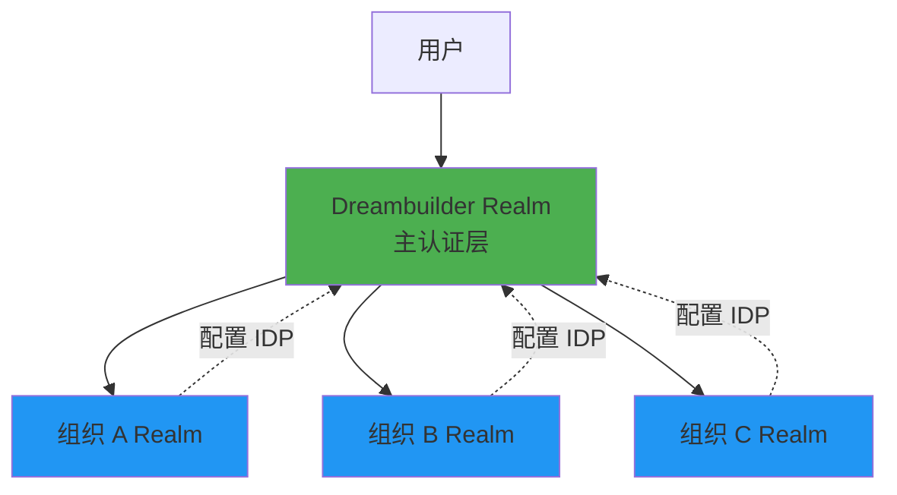
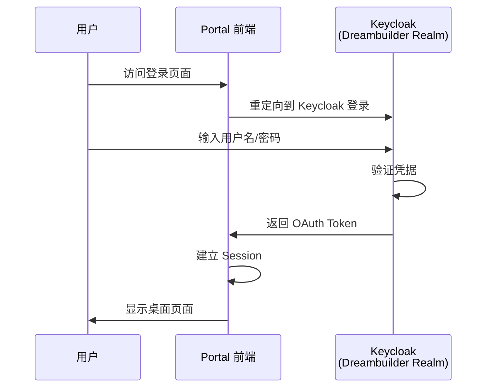
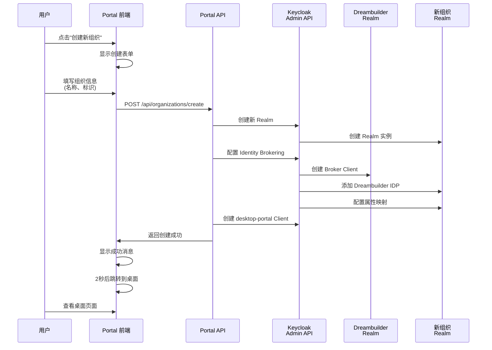
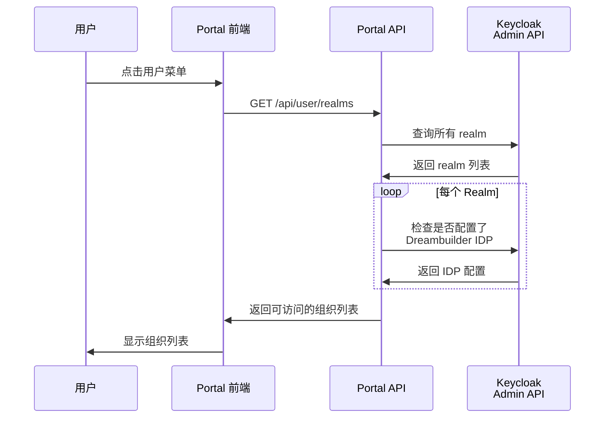
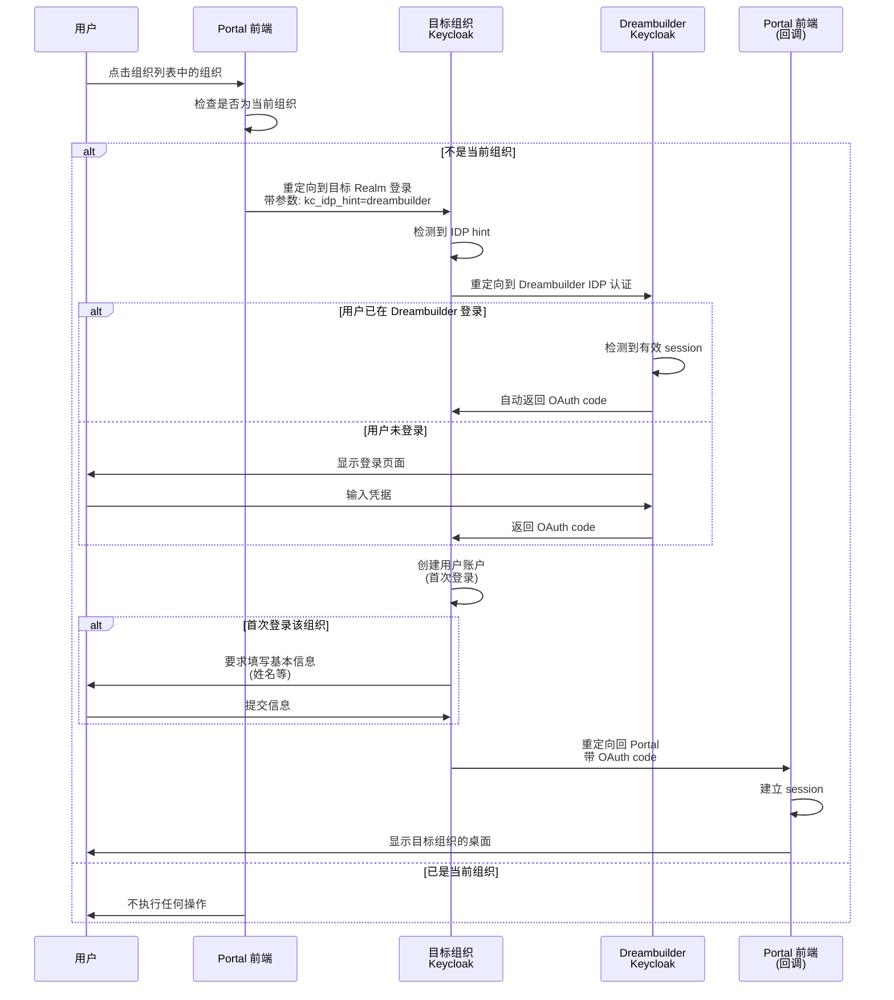
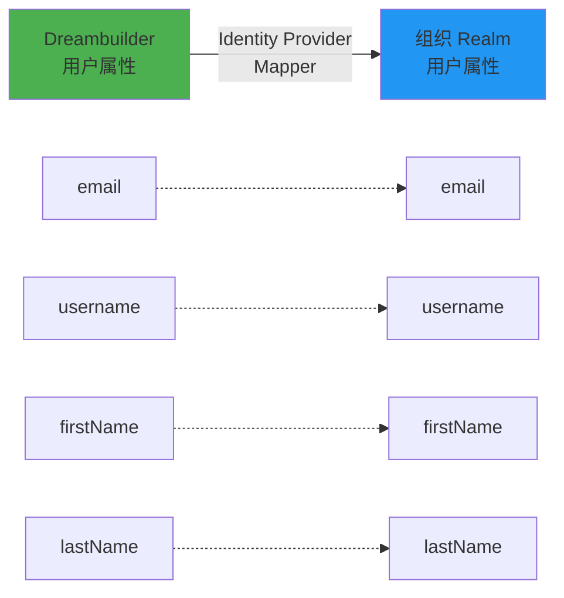

# 组织管理与 SSO 登录流程

## 概述

本文档描述了 DreamBuilder Portal 中基于 Identity Brokering 的多组织管理架构和用户登录流程。该架构允许用户使用统一的凭据访问多个组织，无需为每个组织单独设置密码。

## 架构概述

### 认证架构

系统采用 **Keycloak Identity Brokering** 架构：

- **主 Realm（Dreambuilder）**：所有用户的主要认证 realm
- **组织 Realm**：每个组织对应一个独立的 realm
- **Identity Provider (IDP)**：每个组织 realm 配置 Dreambuilder 作为 IDP
- **统一 SSO**：用户通过 Dreambuilder realm 登录，然后可以 SSO 到任何组织

## 功能流程

### 1. 用户注册与首次登录

**流程说明：**
1. 用户访问系统登录页面
2. 系统重定向到 Keycloak Dreambuilder realm 登录页面
3. 用户输入凭据并提交
4. Keycloak 验证成功后返回 OAuth token
5. NextAuth 建立用户 session
6. 用户进入桌面页面

### 2. 创建新组织

**流程说明：**
1. 用户在桌面页面点击用户菜单中的"创建新组织"
2. 系统显示创建组织表单
3. 用户填写组织名称和组织标识（slug）
4. 表单提交到后端 API
5. 后端执行以下操作：
   - 在 Keycloak 中创建新的 realm
   - 在 Dreambuilder realm 中创建 broker client
   - 在新 realm 中配置 Dreambuilder 作为 Identity Provider
   - 配置用户属性映射（email、username、firstName、lastName）
   - 在新 realm 中创建 desktop-portal client
6. 创建成功后，前端显示成功消息
7. 2秒后自动返回桌面页面
8. 新组织自动出现在用户的组织列表中

**关键特性：**
- ✅ 自动配置 Identity Brokering
- ✅ 无需手动设置密码
- ✅ 创建完成后即可访问

### 3. 查看可访问的组织列表

**流程说明：**
1. 用户点击顶部导航栏的用户名/头像
2. 系统调用 API 获取用户可访问的组织列表
3. 后端查询所有 realm（排除 master 和 Dreambuilder）
4. 对每个 realm，检查是否配置了 Dreambuilder Identity Provider
5. 返回所有配置了 Dreambuilder IDP 的 realm
6. 前端显示组织列表，包括：
   - 组织名称（displayName）
   - Realm 标识符
   - 当前组织标记

### 4. 切换到其他组织

**流程说明：**
1. 用户在组织列表中点击某个组织
2. 系统检查是否为当前组织
3. 如果是不同的组织：
   - 浏览器重定向到目标 realm 的 OAuth 认证端点
   - 使用 `kc_idp_hint=dreambuilder` 参数自动触发 Identity Provider
   - Keycloak 自动重定向到 Dreambuilder realm 进行认证
   - 如果用户在 Dreambuilder realm 有有效 session，自动完成 SSO
   - 如果用户未登录，显示 Dreambuilder 登录页面
   - 认证成功后，目标 realm 自动创建用户账户（首次登录时）
   - 如果是首次登录该组织，要求用户填写基本信息
   - 完成后返回 Portal，建立新的 session
   - 显示目标组织的桌面页面

**关键特性：**
- ✅ 自动 SSO 认证
- ✅ 无需重新输入密码
- ✅ 首次登录自动创建账户
- ✅ 保持用户会话连续性

### 5. 用户属性同步

**同步的属性：**
- Email 地址
- 用户名（preferred_username）
- 名字（firstName）
- 姓氏（lastName）

**同步模式：** FORCE - 每次登录时强制同步

## 技术实现

### Identity Brokering 配置

**在 Dreambuilder Realm 中：**
- 为每个组织创建一个 broker client
- Client ID 格式：`{realmName}-broker`
- 配置 redirect URIs 以支持组织 realm 的回调

**在组织 Realm 中：**
- 添加 Identity Provider：`dreambuilder`
- Provider 类型：`keycloak-oidc`
- 配置 OAuth 端点指向 Dreambuilder realm
- 启用 `trustEmail` 和 `storeToken`
- 配置属性映射器

### 用户会话管理

**Session 策略：**
- 策略：JWT
- 有效期：30 天
- 存储位置：浏览器 Cookie

**Token 管理：**
- Access Token：30 分钟
- Refresh Token：自动刷新
- Session Token：在 NextAuth 中管理

## 安全考虑

### 认证安全

1. **统一认证点**：所有用户通过 Dreambuilder realm 认证
2. **Token 加密**：OAuth tokens 使用 RS256 签名
3. **Session 保护**：使用 secure cookies 和 CSRF 保护
4. **自动超时**：Session 30 天后自动过期

### 数据隔离

1. **Realm 级别隔离**：每个组织的数据在独立的 realm 中
2. **用户账户独立**：虽然通过 SSO 创建，但在每个 realm 中是独立的用户
3. **权限隔离**：不同组织的权限互不影响

### HTTPS 要求

- 生产环境必须使用 HTTPS
- Keycloak 配置 `sslRequired: external`
- Cookie 使用 `secure` 标志

## 故障处理

### 常见问题

**问题：创建组织后无法访问**
- 原因：Identity Brokering 配置失败
- 解决：使用管理工具 API 重新配置 IDP
- API：`POST /api/organizations/setup-brokering`

**问题：切换组织需要重新登录**
- 原因：Dreambuilder realm session 已过期
- 解决：重新登录 Dreambuilder realm

**问题：组织列表为空**
- 原因：没有配置 Dreambuilder IDP 的组织
- 解决：确保组织创建时正确配置了 Identity Brokering

### 调试工具

**检查 Keycloak 配置：**
1. 访问 Keycloak Admin Console
2. 切换到目标 realm
3. 查看 Identity Providers 列表
4. 确认 `dreambuilder` provider 存在且已启用

**检查用户 session：**
1. 在浏览器开发者工具中查看 Cookies
2. 确认 `next-auth.session-token` 存在
3. 调用 `GET /api/auth/session` 查看 session 详情

## 后续优化

### 建议改进

1. **组织权限管理**
   - 为组织添加角色管理
   - 支持组织管理员邀请成员
   - 实现细粒度的权限控制

2. **用户体验优化**
   - 添加组织切换的加载动画
   - 优化首次登录流程，减少信息填写步骤
   - 记住用户最后访问的组织

3. **性能优化**
   - 缓存组织列表
   - 优化 realm 查询性能
   - 实现增量更新机制

4. **监控与日志**
   - 添加组织创建和切换的审计日志
   - 监控 SSO 认证成功率
   - 跟踪用户在不同组织间的活动

## 参考资料

- Keycloak Identity Brokering 文档
- OAuth 2.0 Authorization Code Flow
- NextAuth.js 文档
- OIDC (OpenID Connect) 规范

