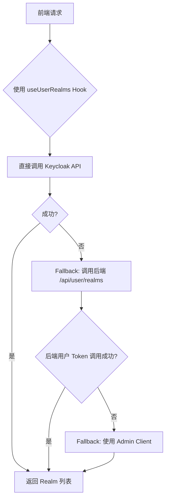

# Realm API 优化方案

## 问题分析

原有的 `/api/user/realms` 接口存在以下问题：

1. **依赖 Admin 凭据**：使用 Keycloak Admin Client，需要在后端存储 admin 用户名密码
2. **性能问题**：每次请求都需要：
   - 使用 admin 凭据认证
   - 遍历所有 realm
   - 检查每个 realm 的 IDP 配置
3. **Token 过期问题**：Admin token 可能过期，需要重新认证
4. **安全性问题**：使用 admin 权限访问，权限过大
5. **扩展性差**：难以支持基于用户权限的细粒度控制

## 优化方案对比

### 方案 A：后端使用用户 Token（已实现）

**文件**: `app/api/user/realms/route.ts`

**优势**：
- ✅ 使用用户 token 而非 admin 凭据
- ✅ 基于用户实际权限
- ✅ 更安全
- ✅ 兼容旧的调用方式

**劣势**：
- ⚠️ 仍需经过后端代理
- ⚠️ 增加服务器负载
- ⚠️ 需要配置 CORS（如果前端跨域调用）

**使用方法**：
```typescript
// 前端组件中
const response = await fetch('/api/user/realms')
const data = await response.json()
console.log(data.realms)
```

### 方案 B：前端直接调用 Keycloak API（推荐）⭐

**文件**: 
- `lib/api/keycloak-client.ts` - Keycloak 客户端
- `hooks/use-user-realms.ts` - React Hook

**优势**：
- ✅ 不依赖后端代理，减少服务器负载
- ✅ 使用用户 token 鉴权，更安全
- ✅ 更快的响应速度（少一跳）
- ✅ 自动 fallback 到后端 API
- ✅ 更灵活，可扩展性强

**劣势**：
- ⚠️ 需要前端能访问 Keycloak（网络配置）
- ⚠️ Token 暴露在前端（但这是 OAuth2 标准做法）

**使用方法**：

#### 选项 1：使用 React Hook（最简单）

```typescript
'use client'

import { useUserRealms } from '@/hooks/use-user-realms'

export function MyComponent() {
  const { realms, loading, error, refetch } = useUserRealms()

  if (loading) return <div>加载中...</div>
  if (error) return <div>错误: {error}</div>

  return (
    <div>
      {realms.map(realm => (
        <div key={realm.realmName}>{realm.displayName}</div>
      ))}
    </div>
  )
}
```

#### 选项 2：直接调用客户端函数

```typescript
import { useSession } from 'next-auth/react'
import { getUserRealms } from '@/lib/api/keycloak-client'

const { data: session } = useSession()

if (session?.accessToken) {
  const realms = await getUserRealms(session.accessToken as string)
  console.log(realms)
}
```

### 方案 C：混合方案（当前实现）✨

结合方案 A 和 B 的优势：

1. **优先使用前端直接调用**（方案 B）
2. **失败时自动 fallback 到后端 API**（方案 A）
3. **后端 API 再 fallback 到 Admin Client**

**流程图**：



## 实现细节

### 1. 前端 Keycloak 客户端

`lib/api/keycloak-client.ts` 提供以下功能：

- `getUserRealms(accessToken)` - 获取用户可访问的 realm 列表
- `getRealmInfo(realmName, accessToken)` - 获取指定 realm 详情
- `validateToken(accessToken)` - 验证 token 是否有效
- 自动 fallback 机制

### 2. React Hook

`hooks/use-user-realms.ts` 提供：

- 自动获取和管理 realm 列表
- Loading 状态管理
- 错误处理
- 手动刷新功能（`refetch`）
- 自动 fallback

### 3. 后端 API 增强

`app/api/user/realms/route.ts` 改进：

- 优先使用用户 token 调用 Keycloak Admin API
- 失败时 fallback 到 Admin Client
- 更详细的错误日志
- 性能优化

## 安全性考虑

### Token 使用

1. **前端 Token**：
   - Access token 通过 NextAuth session 管理
   - 存储在 HTTP-only cookie 中
   - 前端通过 `useSession()` 访问
   - 符合 OAuth2 标准实践

2. **后端 Admin 凭据**：
   - 仅作为 fallback 使用
   - 存储在环境变量中
   - 不暴露给前端

### CORS 配置

如果前端直接调用 Keycloak：

```nginx
# Nginx 配置示例
location /realms/ {
    proxy_pass http://keycloak:8080/realms/;
    add_header 'Access-Control-Allow-Origin' '$http_origin' always;
    add_header 'Access-Control-Allow-Methods' 'GET, POST, OPTIONS' always;
    add_header 'Access-Control-Allow-Headers' 'Authorization, Content-Type' always;
    add_header 'Access-Control-Allow-Credentials' 'true' always;
}
```

## 性能对比

| 方案 | 请求次数 | 响应时间 | 服务器负载 |
|------|---------|---------|-----------|
| 原方案（Admin Client） | 1 次后端 | ~500ms | 高 |
| 方案 A（后端用户 Token） | 1 次后端 | ~300ms | 中 |
| 方案 B（前端直接调用） | 0 次后端 | ~150ms | 低 |

## 推荐使用方式

### 新组件

使用 `useUserRealms` Hook：

```typescript
import { useUserRealms } from '@/hooks/use-user-realms'

export function OrganizationList() {
  const { realms, loading, error } = useUserRealms()
  
  // ... 渲染逻辑
}
```

### 现有组件迁移

1. 将 `fetch('/api/user/realms')` 替换为 `useUserRealms()`
2. 使用返回的 `realms`、`loading`、`error` 状态
3. 如果需要手动刷新，调用 `refetch()`

### 示例：UserMenu 组件

```typescript
'use client'

import { useUserRealms } from '@/hooks/use-user-realms'

export function UserMenu() {
  const { realms, loading, error } = useUserRealms()
  
  return (
    <div>
      {loading && <div>加载中...</div>}
      {error && <div>错误: {error}</div>}
      {realms.map(realm => (
        <button key={realm.realmName} onClick={() => switchRealm(realm.realmName)}>
          {realm.displayName}
        </button>
      ))}
    </div>
  )
}
```

## 监控和调试

### 日志

- 前端：查看浏览器控制台，搜索 `[KeycloakClient]` 或 `[useUserRealms]`
- 后端：查看服务器日志，搜索 `[API]`

### 常见问题

**Q: 前端调用 Keycloak 返回 403？**
A: 用户可能没有权限访问 Admin API。系统会自动 fallback 到后端 API。

**Q: 所有方案都失败了？**
A: 检查：
1. Keycloak 是否运行
2. 网络连接
3. Token 是否过期
4. Admin 凭据是否正确

**Q: Realm 列表为空？**
A: 可能原因：
1. 用户确实没有可访问的组织
2. Realm 没有配置 DreamBuilder IDP
3. Realm 被禁用（`enabled: false`）

## 后续优化建议

1. **缓存策略**：
   - 在前端缓存 realm 列表（5分钟）
   - 使用 React Query 管理缓存和自动刷新

2. **预加载**：
   - 登录后立即预加载 realm 列表
   - 减少首次打开菜单的等待时间

3. **增量更新**：
   - 使用 WebSocket 或 Server-Sent Events
   - 当 realm 配置变化时自动更新前端

4. **权限细化**：
   - 基于用户角色显示不同的 realm
   - 支持 realm 级别的权限控制

## 总结

推荐使用**方案 B（前端直接调用）+ 自动 fallback**的混合方案：

✅ 性能最优  
✅ 服务器负载最低  
✅ 用户体验最好  
✅ 有备用方案保证可用性  
✅ 符合现代前端最佳实践  

只需将现有代码从 `fetch('/api/user/realms')` 迁移到 `useUserRealms()` Hook 即可。


